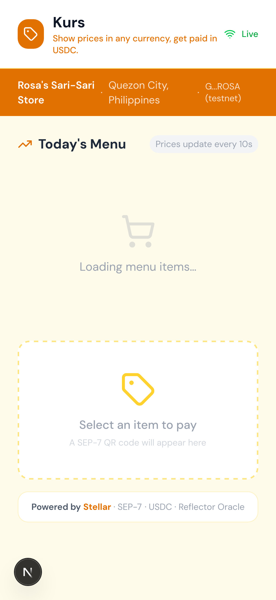
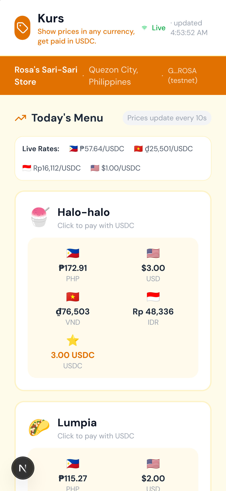
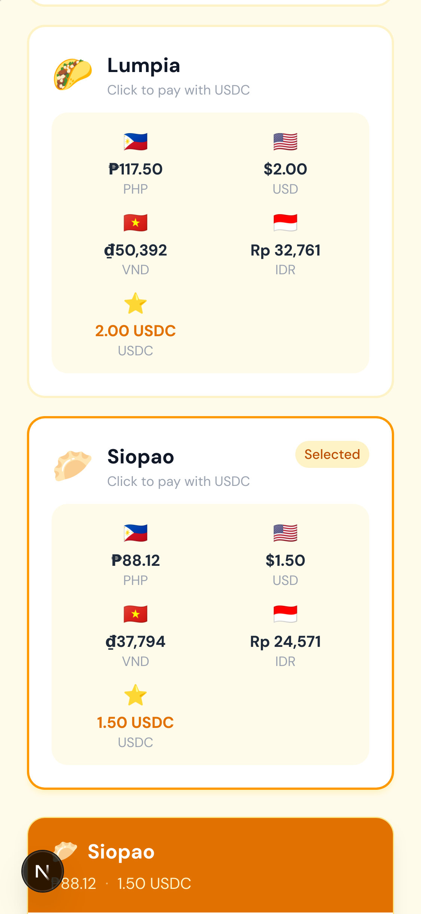

# Multi-Currency Price Tag FX Widget

An FX-aware price tag and payment request experience for Stellar issued assets.

Live preview: [kurs-fx-widget.vercel.app](https://017-multi-currency-price-tag-fx-wid.vercel.app/)

## Stellar surface

- Classic Stellar USDC uses seven-decimal stroops (`1 USDC = 10,000,000`)

- Horizon payment intent and transaction verification
- Issued-asset issuer identity and quote-expiry checks
- SEP-7-compatible payment request direction for wallet signing
- External-signer payment flow: prepare an unsigned XDR, verify the signed digest and exact USDC payment, then submit through Horizon

## Readiness status

This repository is in hackathon readiness hardening. The catalog preview and simulation endpoint are demo-only, while the Freighter path prepares and verifies a real classic USDC payment on the configured network. The live Vercel preview is demo/testnet-configured; no classic-payment mainnet transaction is claimed yet.

See [`docs/MAINNET_READINESS.md`](docs/MAINNET_READINESS.md) for the evidence checklist.

## Local demo

The public preview runs in demo mode without a database. For a real testnet payment, connect Freighter, configure a funded sender, and use a merchant account with the configured USDC trustline. For a local run, install dependencies and use `npm run dev`.

## Screenshots






Keep all credentials outside Git. The browser wallet signs; the server never receives a private key. The simulation button is for UI preview only and does not create on-chain evidence.

## Mainnet gate

Mainnet requires a real quote provider, issuer configuration, wallet-signed payment, Horizon confirmation, idempotency, and an auditable quote/payment reconciliation path.

The production-shaped payment path is `POST /api/payments/prepare`, followed by Freighter signing and `POST /api/payments/:id/confirm`. The server never stores or receives a secret key. Apply the `drizzle/0001_unsigned_payment_intents.sql` migration before using a persistent database. See [`docs/TESTNET_PAYMENT_RUNBOOK.md`](docs/TESTNET_PAYMENT_RUNBOOK.md) for the operator flow.

## Friend transaction flow

1. Open the live preview in Chrome with Freighter installed.
2. Select a menu item and click **Connect Freighter**.
3. Click **Pay with Freighter**.
4. Review network, sender, merchant, amount, asset, memo, and fee in Freighter.
5. Approve the signature; the app verifies and submits the signed XDR, then shows the transaction hash.

The current configured asset is USDC. A real payment requires the sender and merchant to exist on the selected network and hold the configured USDC trustline.

## Soroban contract

The repository includes an independent Soroban `quote-registry` contract for the hackathon technical requirement. It publishes short-lived FX rates, creates payment quotes, and marks quotes paid after payer authorization; the existing classic USDC payment remains the settlement flow.

- Source: [`contracts/quote-registry/src/lib.rs`](contracts/quote-registry/src/lib.rs)
- WASM SHA-256: `b63f93ff5d35e24d53d92cb27ea473e03f7efcb2121b2dfb330df80d2ea6e0ba`
- Deployment metadata and unsigned-XDR workflow: [`contracts/quote-registry/`](contracts/quote-registry/)

The live UI also exposes a small mainnet contract panel. After connecting Freighter with
the contract admin wallet, **Read USD/XLM** simulates `get_rate` and **Publish demo rate**
prepares, asks Freighter to sign, and submits `publish_rate` through Soroban RPC. The
contract address is fixed in [`src/lib/quote-registry-client.ts`](src/lib/quote-registry-client.ts).

Build and test locally:

```bash
cargo test --offline --manifest-path contracts/quote-registry/Cargo.toml
rustup run stable cargo build --manifest-path contracts/quote-registry/Cargo.toml --target wasm32v1-none --release
```
